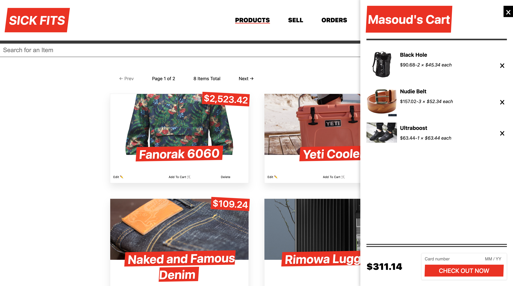

# Sick-Fits-UI
An online clothing store with a focus on modern JavaScript and start-to-finish way of Full Stack Advanced React, Apollo, Next.js, GraphQL, Node.js.
Part of a premium traning course [FullStack Advanced React & GraphQL](https://advancedreact.com/) from [Wes Bos](https://github.com/wesbos)

### Preview

## Tech stack

### Frontend

- ReactJS
- NextJS
- Apollo client
- Styled components

### Backend

- NodeJS
- GraphQL
- Keystone Headless CMS
- MongoDB Atlas
